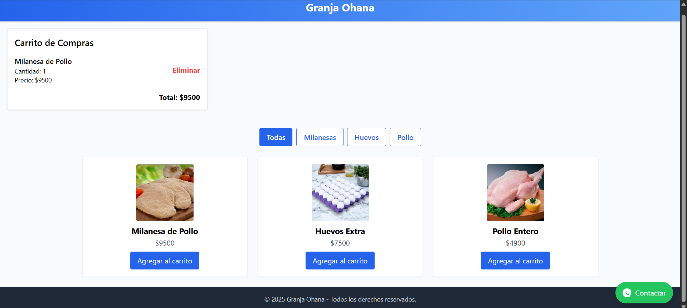

# 🐔 Granja Ohana - Catálogo Web

Sitio web desarrollado para **Granja Ohana**, con un catálogo de productos moderno, filtros por categoría, carrito de compras y contacto directo por WhatsApp.  
Ideal para ventas en tiendas físicas o emprendedores que quieren mostrar sus productos online de forma profesional y simple.

[](https://wa.me/5491158828724)

---

## 🚀 Características

- ✅ Catálogo dinámico con filtros
- ✅ Carrito de compras funcional (con suma total)
- ✅ Estilo profesional con **Tailwind CSS**
- ✅ Responsive (se adapta a móviles y escritorio)
- ✅ Botón flotante de WhatsApp
- ✅ Preparado para integración futura con Mercado Pago

---

## 🖼️ Captura de pantalla



---

## 🧪 Tecnologías

- ⚛️ [React](https://reactjs.org/)
- ⚡ [Vite](https://vitejs.dev/)
- 🎨 [Tailwind CSS](https://tailwindcss.com/)

---

## 📦 Instalación local

```bash
git clone https://github.com/tu-usuario/catalogo-granja.git
cd catalogo-granja
npm install
npm run dev

📱 Contacto
Desarrollado por Mauro Flores

📧 Email: mauroaleflores@gmail.com

📲 WhatsApp: 1158828724

🌐 Web personal: floresmauro.github.io

